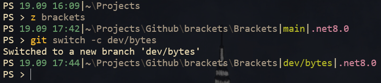
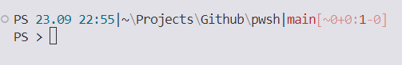

# PowerShell profile and scripts

Defines a custom prompt function that replaces the `$Home` part of the current path with '~', displays the time, current path, git status, and .NET version in the current project file, and sets the window title to the current folder name. The prompt also displays a different prompt character ('>' or '>>') depending on the current nested prompt level and whether there was an error in the previous command.

How it might look like:

## MyTools.psm1

The `Find-File` function takes a `FileName` parameter and searches the current directory and all subdirectories for files with that name. It returns an array of `System.IO.FileInfo` objects representing the matching files.

The `Open-File` function is used to open files in an external editor. It has two ways to input a file: by pipeline or by filename. If a `FileInfo` object is piped in, it will be opened in the default editor. If a filename is provided, it will be opened in the specified editor (`C:\Program Files\EditPlus\editplus.exe` by default). It accepts an optional `$Index` parameter that can be used to open multiple files by index.
